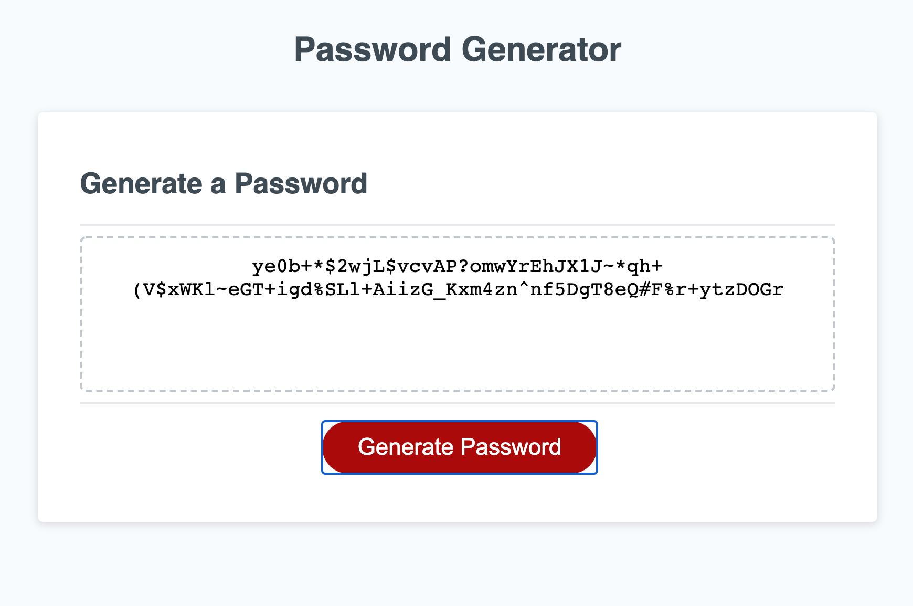

# Password Generator
Here, we use our knowledge of javascript to create a password generator. We are given a set of instructions. We ask the user with a prompt a series of questions to generate a said password. This is our criteria. This criteria ensure that the password meets the user's requests. The structure of this site is given to us. We are working the client-side of the button's function to generate a password.
## Site Picture

## Installing 
In the UCB directory inside the Javascript/Develop folder, we find our three essential items. Index.html, style.css, and our script.js files. This will allow us to get started. 
## Getting started 
The main focus is within the javascript file. The file gives us a template to begin with. 

Code snippet:
```
// Assignment Code
var generateBtn = document.querySelector("#generate");

// Write password to the #password input
function writePassword() {
  var password = generatePassword();
  var passwordText = document.querySelector("#password");

  passwordText.value = password;

}

// Add event listener to generate button
generateBtn.addEventListener("click", writePassword);
```

### Technologies Used
* HTML
* CSS
* Javascript

## Deployed Links
* [Link to repository]( https://github.com/Kionling/password-generator)
* [Link to site]( https://kionling.github.io/password-generator/)
## Author 
* [Daniel Jauregui](https://www.linkedin.com/in/daniel-jauregui-velazquez-b64a80172/)
## Acknowlegments 
* [Java operators](https://docs.oracle.com/javase/tutorial/java/nutsandbolts/opsummary.html)